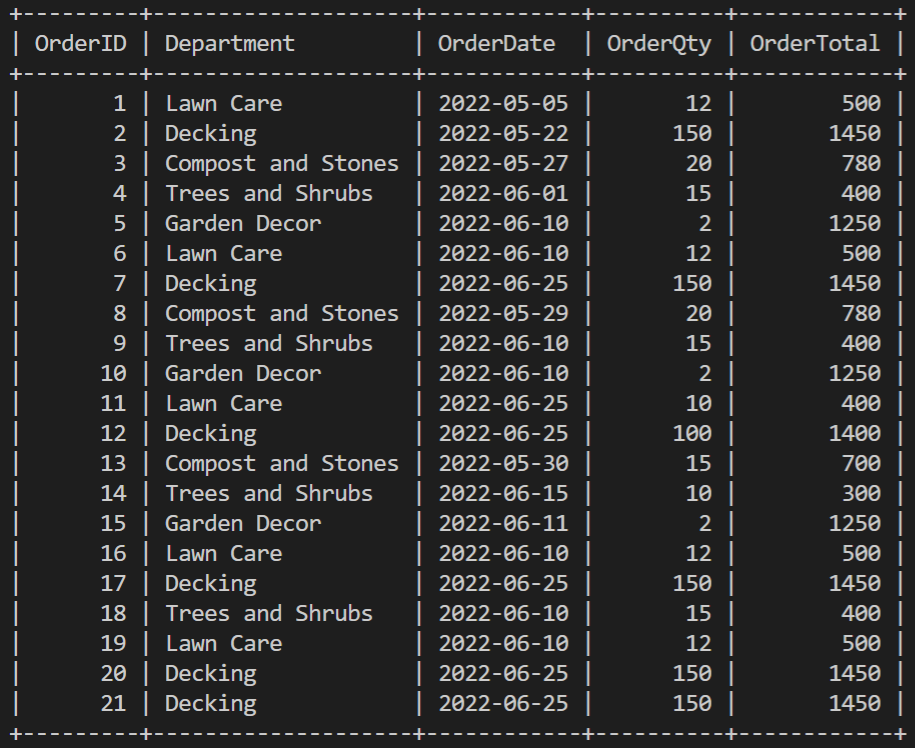
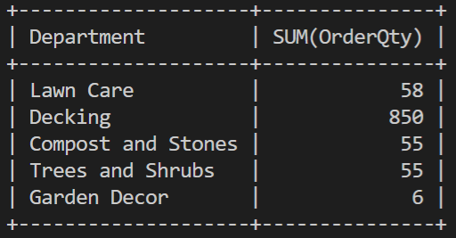
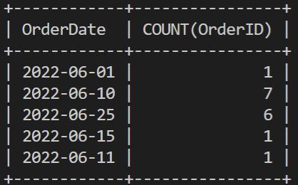

# Lab Instructions
Lucky Shrub is a medium-sized garden design firm that sells indoor and outdoor plants, making them a one stop shop for clients. In this lab, you must complete the following tasks to help Lucky Shrub group and filter grouped data for their reports using the GROUP BY and HAVING clauses.

The Orders table used for this lab contains the following data: OrderID, Department, OrderDate, OrderQty and OrderTotal as shown below.




## Prerequisites
To complete this lab, you must have the Lucky Shrub database created in MySQL. You must also create and populate the Orders table with relevant data inside the Lucky Shrub database.

The code to create the database and the Orders table is as follows.


```bash
# 1: Create database 
CREATE DATABASE luckyshrub_grouping_db;

# 2: Use database
USE luckyshrub_grouping_db;

# 3: Create Orders table
CREATE TABLE Orders(OrderID INT, Department VARCHAR(100), OrderDate DATE, OrderQty INT, OrderTotal INT, PRIMARY KEY(OrderID));

# 4: Insert data
INSERT INTO Orders VALUES(1,'Lawn Care','2022-05-05',12,500),(2,'Decking','2022-05-22',150,1450),(3,'Compost and Stones','2022-05-27',20,780),(4,'Trees and Shrubs','2022-06-01',15,400),(5,'Garden Decor','2022-06-10',2,1250),(6,'Lawn Care','2022-06-10',12,500),(7,'Decking','2022-06-25',150,1450),(8,'Compost and Stones','2022-05-29',20,780),(9,'Trees and Shrubs','2022-06-10',15,400),(10,'Garden Decor','2022-06-10',2,1250),(11,'Lawn Care','2022-06-25',10,400), 
(12,'Decking','2022-06-25',100,1400),(13,'Compost and Stones','2022-05-30',15,700),(14,'Trees and Shrubs','2022-06-15',10,300),(15,'Garden Decor','2022-06-11',2,1250),(16,'Lawn Care','2022-06-10',12,500),(17,'Decking','2022-06-25',150,1450),(18,'Trees and Shrubs','2022-06-10',15,400),(19,'Lawn Care','2022-06-10',12,500),(20,'Decking','2022-06-25',150,1450),(21,'Decking','2022-06-25',150,1450);

```


## Objectives
This activity has two main objectives:

1. Group data using the GROUP BY clause.
2. Filter grouped data using the HAVING clause.


### Exercise Instructions
Please attempt the following tasks:

**Task 1**: Write a SQL SELECT statement to group all records that have the same order date.

The expected output result should be the same as the following screenshot, assuming that you have created and populated the tables correctly.


**Task 2**: Write a SQL SELECT statement to retrieve the number of orders placed on the same day.

The expected output result should be the same as the following screenshot assuming that you have created and populated the tables correctly.


**Task 3**: Write a SQL SELECT statement to retrieve the total order quantities placed by each department.

The expected output result should be the same as the following screenshot assuming that you have created and populated the tables correctly.




**Task 4**: Write a SQL SELECT statement to retrieve the number of orders placed on the same day between the following dates: 1st June 2022 and 30th June 2022.

The expected output result should be the same as the following screenshot assuming that you have created and populated the tables correctly.


